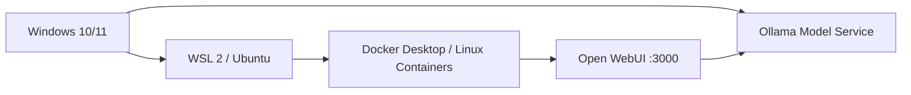
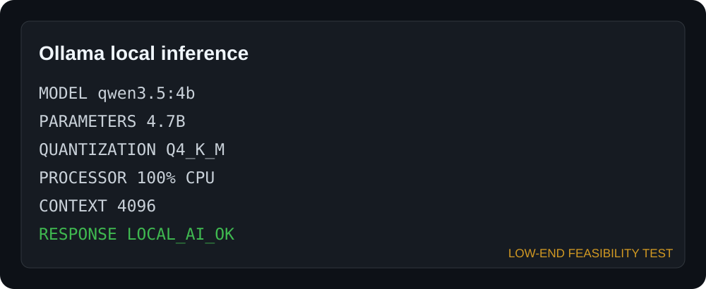

# Local AI Workstation Guide / 本地 AI 工作站搭建指南

**简体中文** | [English summary](README_EN.md)

> Dynamic documentation last reviewed: 2026-08-10. Versions, model names, quotas, endpoints and UI paths must be rechecked against official sources before updates.

<p align="center"><strong>Windows 新手从开启虚拟化，到 WSL 2 + Docker + Ollama + Open WebUI 的可复现基础路线。</strong><br>A Windows-first path from virtualization to a local AI chat workstation with WSL 2, Docker, Ollama, and Open WebUI.</p>

> **Public Preview status:** ✅ Static · ✅ Runtime · ✅ Visual review · ⚠️ Clean Windows end-to-end validation pending
>
> Tested on Windows 11, Ryzen 5 5625U, 16GB RAM and AMD integrated graphics. This is a low-spec feasibility environment, not a recommended high-performance LLM configuration.

<p align="center">
  
  
  
  
  
  
</p>

> [!IMPORTANT]
> 本教程不包含任何真实 API Key，也不会要求把令牌写进代码或提交到 Git。示例只使用环境变量和占位符。

> [!NOTE]
> 本仓库是独立教育项目，与文中提到的服务商不存在官方合作、赞助或背书关系。试用额度、价格与模型可用性会变化，请以各服务商最新页面为准。详见 [免责声明 / Disclaimer](DISCLAIMER.md)。

## 从这里开始 / Start Here

这不是一组需要读者自己拼接的零散文章，而是一套分类明确、可以顺序完成的 Windows AI 工作站开源教程。第一次阅读请从第 00 章开始，并使用每页顶部的“教程阶段 / 阅读范围 / 前置内容”和底部的“上一篇—教程首页—下一篇”继续；不要依赖 GitHub 文件名猜测顺序。

> **完整学习路线：** V0.1 本地工作站 → V0.2 云 API → V0.3 受控 Coding Agent → V0.4 Advanced / Experimental Routing。

[▶ 从第 00 章开始：路线、术语与架构](docs/00-roadmap.md)

| 你的目标 | 建议阅读范围 | 完成标志 |
| --- | --- | --- |
| 只搭建本地 AI | 第 00–05 章，再阅读 09、10、12 | Ollama + Open WebUI 本地对话通过 |
| 增加云模型 | 完成本地路线后继续第 06 章及 Cloud 专题 | DeepSeek 或百炼/Qwen 至少一条合法 API 路线通过 |
| 学习 Coding Agent | 继续第 07–12 章及 Agent 专题 | 隔离 Agent Lab、测试和差异审查通过 |
| 学习社区路由 | 最后阅读第 13 章及 Routing 专题 | 理解单 Provider Runtime 证据与未测试边界 |

所有人都可以顺序读完整教程；“选做”只表示不是 V0.1 本地工作站的完成条件，不表示章节可以在不了解前置边界时随意跳读。

## 版本路线 / Version Roadmap

- ✅ V0.1 — Local AI：Ollama + Open WebUI（`v0.1.0-rc.2`）
- ✅ V0.2 — Cloud AI：DeepSeek + 百炼/Qwen + Open WebUI（`v0.2.0-rc.1`）
- ✅ V0.3 — Coding Agent：隔离 Agent Lab + Codex Runtime（`v0.3.0-rc.1`）
- ✅ V0.4 — Advanced Routing：Claude Code → CCR → DeepSeek 单 Provider Runtime（`v0.4.0-rc.1`，Advanced / Experimental）

详细范围、发布门禁与拆分原则见 [ROADMAP.md](ROADMAP.md)。V0.2–V0.4 是同一仓库的后续版本，不会复制四套教程目录。

V0.4 当前只证明 **Claude Code → CCR → DeepSeek** 的 loopback 单 Provider 路线；Codex 仅完成 Responses 静态兼容检查，多 Provider 切换 Runtime 未测试。它是已公开的 Advanced / Experimental RC，不代表上述未测试能力已经通过。


### 如何理解 RC 版本 / Understanding RC versions

版本格式为 `v主版本.次版本.修订版本-rc.候选序号`，即 `vMAJOR.MINOR.PATCH-rc.N`。

| 版本 | 关系与含义 |
| --- | --- |
| `v0.1.0-rc.1` | V0.1 本地工作站的第一个公开候选版 |
| `v0.1.0-rc.2` | 仍属于 V0.1，是对 `rc.1` 的修正与完善 |
| `v0.2.0-rc.1` | 进入新的 V0.2 Cloud AI 功能线，因此候选序号重新从 1 开始 |
| `v0.3.0-rc.1` | V0.3 Coding Agent 功能线的第一个公开候选版 |
| `v0.4.0-rc.1` | V0.4 Advanced / Experimental Routing 功能线的第一个公开候选版，也是当前最新 RC |
| `v0.4.0` | 将来的 V0.4 正式稳定版，目前尚未发布 |

`v0.2.0-rc.1` 比 `v0.1.0-rc.2` 新：先比较基础版本 `0.2.0 > 0.1.0`，再看同一基础版本内部的 RC 序号。不能脱离基础版本，只拿 `rc.1` 和 `rc.2` 判断新旧。

```text
v0.1.0-rc.1 → v0.1.0-rc.2 → v0.2.0-rc.1 → v0.3.0-rc.1 → v0.4.0-rc.1（当前）
```

V0.2 是在 V0.1 基础上的增量升级，包含原有本地工作站路线并增加云 API；不是另一个互不相关的教程。各版本的完整双语说明见 [GitHub Releases](https://github.com/xiaoyao12740/local-ai-workstation-guide/releases)。

## V0.3 Coding Agent / 安全编码代理 — `v0.3.0-rc.1`

V0.3 在保留 V0.1 本地工作站与 V0.2 云 API 路线的基础上，增加 Agent 循环、最小权限、审批边界、提示注入防护、Claude Code/Codex 支持分层和无第三方依赖的隔离 Agent Lab。实验只允许在被 Git 忽略的 `.agent-runtime/<agent>` 副本内运行。

V0.3 adds the agent loop, least privilege, approval boundaries, prompt-injection awareness, Claude Code/Codex support layers, and an offline standard-library lab. Start from [V0.3 双语入口 / bilingual entry](docs/07-agent-basics.md). V0.4 CCR routing remains advanced and experimental.

## V0.2 Cloud AI — `v0.2.0-rc.1`


V0.2 已在隔离的 `127.0.0.1:3001` Open WebUI 实例中完成 DeepSeek 与阿里云百炼/Qwen 的真实调用、模型发现和双语对话验证。API Key、Workspace ID、余额与账户信息均未进入仓库；Python 临时环境变量与 Open WebUI 持久化 Connection 的安全边界分别说明。

- DeepSeek：Static + Runtime PASS
- 百炼/Qwen：Static + Runtime PASS
- Open WebUI Cloud：Isolated Runtime + Visual PASS
- OpenAI / Claude：Documentation only，Runtime NOT TESTED

从 [V0.2 云 API 入口](docs/06-cloud-api.md) 开始，完整证据见 [V0.2 Validation](V0.2_VALIDATION.md)。模型生成的自我介绍不等于厂商事实，价格、额度和 Model ID 必须以当前官方资料及控制台为准。

## V0.1 最终成果 / What You Will Build


维护者机器上的真实结果：Open WebUI 已识别并调用本地 `qwen3.5:4b`，能够生成结构化中英双语回复。整套工作站已在低配置设备上完成运行验证；该设备证明“能够运行”，不代表推荐性能。截图中的能力描述是模型生成内容，只用于展示交互体验，不构成性能评测或事实保证。软件界面会随版本变化，请以模型可选、消息成功返回和健康检查为准。单次响应时间与物理限制记录在[硬件与模型选择](docs/02-gpu-model-selection.md#能力上限不等于可用速度)中。



完成后，你应当能够：

- 在 Windows 与 WSL 2 中确认虚拟化、文件系统、网络和 GPU 状态。
- 用 Ollama 下载并运行适合显存的本地模型，通过 HTTP API 调用。
- 用 Docker Compose 隔离运行 Open WebUI，并从浏览器访问本地模型。
- 判断每条命令应在 Windows PowerShell 还是 WSL Bash 中运行。
- 通过统一只读脚本判断组件是未安装、已安装但未运行，还是健康可用。

Cloud API、Claude Code、Codex 与 CCR 文档已保留为后续增强内容，不属于 V0.1 完成条件。

### Runtime proof / 真实运行证据



上图是根据 2026-08-10 真实命令输出制作的运行证据摘要，不是终端截图：`qwen3.5:4b` 已在 Ryzen 5 5625U、16GB RAM、无独显测试机上完成本地推理。它证明低配机器可以学习完整链路，不代表这是推荐的高性能推理配置。详细证据见 [Runtime Validation](RUNTIME_VALIDATION.md)。

## 学习路线 / Learning Path

| 阶段 | 中文章节 | English outcome |
| ---: | --- | --- |
| 0 | [路线、术语与架构](docs/00-roadmap.md) | Understand components and trust boundaries |
| 1 | [开启虚拟化与安装 WSL 2](docs/01-virtualization-wsl.md) | Prepare Windows and Ubuntu |
| 2 | [显卡、显存与模型选择](docs/02-gpu-model-selection.md) | Choose a model that actually fits |
| 3 | [Docker 基础与 WSL 2 后端](docs/03-docker.md) | Understand containers and verify the engine |
| 4 | [安装与使用 Ollama](docs/04-ollama.md) | Run and call a local model |
| 5 | [Open WebUI](docs/05-openwebui.md) | Build an isolated chat interface |
| 6（Later） | [Claude、GPT、DeepSeek 与 Qwen API](docs/06-cloud-api.md) | Optional cloud-model extension |
| 7（Later） | [Coding Agent 原理](docs/07-agent-basics.md) | Optional agent foundations |
| 8（Later） | [Claude Code、Codex 与兼容路由](docs/08-claude-code.md) | Optional advanced integration |
| 9 | [安全、令牌与权限](docs/09-security.md) | Protect credentials and the host |
| 10 | [故障排查](docs/10-troubleshooting.md) | Diagnose service and network failures |
| 11（Later） | [Agent 实战](docs/11-agent-lab.md) | Optional controlled coding task |
| 12 | [最终验收](docs/12-acceptance.md) | Prove the workstation works end to end |
| 13（Advanced / Experimental） | [CCR、Gateway 与路由](docs/13-routing.md) | Understand the validated single-provider route and untested boundaries |

## 第一个里程碑：本地 AI 聊天界面 / First Milestone

目标是在 Windows 上完成 `WSL 2 → Docker Desktop → Ollama → 小模型 → Open WebUI`。30–60 分钟只是环境已经较顺利时的参考。实际耗时取决于 Windows 当前状态、是否需要重启、网络速度、Docker 镜像下载速度和模型下载速度；首次配置可能明显超过这一时间。

```text
V0.1 基础路线（所有初学者）
Windows → WSL 2 → Docker → Ollama → Open WebUI

增强路线 A（选做） → DeepSeek / 百炼等云 API
增强路线 B（选做） → Claude Code / Codex
高级路线（选做）   → CCR / 多 Provider / 多 Agent
```

没有安装 CCR、云 API 或 Coding Agent，不影响 V0.1 基础工作站验收。

### 从零开始

如果电脑尚未安装 Git，可以在 GitHub 仓库页面选择 **Code → Download ZIP**，解压后在文件夹空白处右键打开 PowerShell；V0.1 不要求先学会 Git。

1. 按 [开启虚拟化与安装 WSL 2](docs/01-virtualization-wsl.md) 完成 Windows 与 Ubuntu 准备。
2. 阅读 [硬件与模型选择](docs/02-gpu-model-selection.md)，先决定适合自己的模型档位。
3. 按 [Docker 基础与 WSL 2 后端](docs/03-docker.md) 安装并验证 Docker Desktop。
4. 按 [Ollama](docs/04-ollama.md) 安装服务并运行第一个小模型。
5. 按 [Open WebUI](docs/05-openwebui.md) 启动本地聊天界面。

仓库下载完成后，在**仓库根目录的 Windows PowerShell**运行只读检查：

```powershell
powershell -ExecutionPolicy Bypass -File .\scripts\check-environment.ps1
```

如果上述组件已经安装，可使用以下快速验证：

> 默认示例 `qwen3.5:4b` 不是所有电脑的统一推荐。8GB RAM 应优先选择模型库中的更小模型；约 16GB RAM 可从 1B–4B Q4 起步；7B/8B Q4 仅属于较强 CPU 设备的自行尝试范围。低功耗轻薄本“能加载”不等于适合长期推理。

```powershell
# Windows PowerShell；在仓库根目录运行
ollama pull qwen3.5:4b
ollama run qwen3.5:4b

Copy-Item .env.example .env
docker compose up -d
docker compose ps
Invoke-WebRequest http://127.0.0.1:3000/health
```

浏览器打开 <http://localhost:3000>，看到 Ollama 模型并完成一次对话，即达到 V0.1 基础里程碑。首次注册的本地账户由你自己保存；不要将 3000 端口直接暴露到公网。

## 仓库结构 / Repository Layout

```text
.
├── README.md
├── RELEASE_CHECKLIST.md
├── SECURITY.md
├── docker-compose.yml
├── .env.example
├── docs/                     # 分章节教程 / tutorial chapters
├── examples/                 # API 示例 / API examples
└── scripts/                  # 只读检测脚本 / read-only checks
```

## 适用范围 / Scope

本教程以 Windows 10/11 + WSL 2 为主线，具体最低 Windows 版本、Build 与 WSL 版本请以当前 [Docker Desktop system requirements](https://docs.docker.com/desktop/setup/install/windows-install/) 为准。Linux 用户可以参考架构概念与 Ollama 章节，但 Linux-native 安装流程尚未作为 V0.1 验证路线。macOS 的虚拟化、GPU 后端和 Docker 网络行为不同，不作为本仓库主验证平台。

This guide targets Windows 10/11 with WSL 2; consult the current Docker Desktop system requirements for exact Windows builds and WSL versions. Linux readers may reuse the architecture concepts and Ollama guidance, but a Linux-native installation is not a validated V0.1 path. macOS is not the primary validation platform.

本项目保留 Ryzen 5 5625U、16GB RAM、无独立显卡轻薄本这一测试环境，是为了证明低配置机器也能学习完整工具链，并不是把它作为本地大模型推理的推荐配置。此类设备应从小型量化模型起步，把重任务交给合法的云 API，形成 Local LLM + Cloud LLM 的混合工作站。

V0.1 Release Candidate 的静态与运行时验收状态记录在 [RELEASE_CHECKLIST.md](RELEASE_CHECKLIST.md)。

当前维护者机器的真实运行记录见 [RUNTIME_VALIDATION.md](RUNTIME_VALIDATION.md)；该记录不等同于干净 Windows 从零安装验证。

## 安全边界 / Safety Boundary

- 只使用你本人合法获得、服务商允许使用的 API Key。
- 不支持破解 Claude Code、绕过订阅、盗用 Cookie、共享违规账号或接入来源不明的转售令牌。
- 社区路由器不是 Anthropic 官方组件；使用前必须阅读其源码、许可证、更新记录和风险说明。
- Agent 只应在指定项目目录工作，首次执行命令必须人工审查。

详见 [SECURITY.md](SECURITY.md) 与 [安全章节](docs/09-security.md)。

## 官方与主要参考 / Primary References

- [Microsoft: Install WSL](https://learn.microsoft.com/windows/wsl/install)
- [Docker Desktop: WSL 2 backend](https://docs.docker.com/desktop/features/wsl/)
- [Ollama documentation](https://docs.ollama.com/) and [model library](https://ollama.com/library)
- [Open WebUI quick start](https://docs.openwebui.com/getting-started/quick-start/)
- [Alibaba Cloud Model Studio: OpenAI compatibility](https://help.aliyun.com/zh/model-studio/compatibility-of-openai-with-dashscope)
- [DeepSeek API documentation](https://api-docs.deepseek.com/)
- [Anthropic Claude Code documentation](https://docs.anthropic.com/en/docs/claude-code/overview)
- [OpenAI Codex documentation](https://developers.openai.com/codex/)

维护者还应阅读 [研究状态与资料可信度规则](RESEARCH_REQUESTS.md)。任何 AI 搜索结果或社区教程都只作为线索；与当前官方资料冲突时，以官方资料为准。

## English Summary

This repository is a hands-on, security-conscious path to a local AI workstation. It explains not only installation, but also service boundaries, GPU/model fit, container networking, cloud API compatibility, coding-agent routing, credential hygiene, and verifiable acceptance tests.

Start with [the roadmap](docs/00-roadmap.md), follow each gate in order, and do not move to the next layer until the current health check passes.

## License

Code and original documentation are released under the [MIT License](LICENSE). Product names and external documentation belong to their respective owners. See the [project disclaimer](DISCLAIMER.md).
