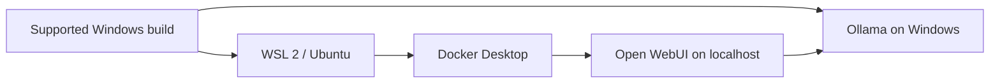
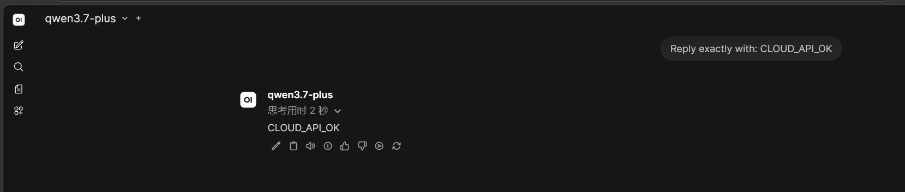

# Local AI Workstation Guide

[简体中文](README.md) | **English summary**

> Last reviewed: 2026-08-10. Versions, quotas, endpoints, model names, and user-interface paths are dynamic; verify them against official documentation before use.

A Windows-first, beginner-friendly guide to building a private AI workstation with WSL 2, Docker Desktop, Ollama, and Open WebUI. The V0.1 path is deliberately small and testable: install the foundations, run one local model, open a browser chat, and verify every service boundary.

> **Release-candidate status:** static checks passed, maintainer runtime checks passed, visual review passed, and a clean-Windows beginner test is still pending.

The maintainer test device is a Ryzen 5 5625U laptop with 16 GB RAM and no discrete GPU. It is a low-spec feasibility case, not a recommended high-performance LLM configuration. On such hardware, 1B–4B Q4 models are the sensible starting tier; 7B/8B Q4 models are experiments, not a promise of smooth daily use.


## What V0.1 builds



Required V0.1 path:

```text
Windows → WSL 2 → hardware/model choice → Docker → Ollama → Open WebUI
```

Optional later paths:

```text
Cloud APIs → Claude Code / Codex → community routing and agent labs
```

Cloud APIs, coding agents, and Claude Code Router are not required to complete V0.1.

## V0.2 Cloud AI status

V0.2 has been runtime-validated with DeepSeek and Alibaba Cloud Model Studio/Qwen through an isolated, loopback-only Open WebUI instance.



- DeepSeek client and Open WebUI conversation: runtime PASS
- Model Studio/Qwen client and Open WebUI conversation: runtime PASS
- Provider keys, the real Workspace ID, balances, and account details are excluded from repository evidence
- Open WebUI Connections and its data volume are treated as persistent sensitive assets
- OpenAI API and Anthropic API remain documentation-only and were **not runtime-tested**

This file remains an English summary, not a complete mirror of every Chinese chapter. Start with the [V0.2 entry page](docs/06-cloud-api.md) and [runtime validation](V0.2_VALIDATION.md).

## Safety rules

- Use only API credentials you obtained legally and that the provider permits for your intended client.
- Never commit real keys, cookies, tokens, `.env` files, or local account databases.
- Do not treat community compatibility as official vendor support.
- Bind the tutorial WebUI to `127.0.0.1`; do not expose port 3000 directly to the public Internet.
- Give an agent only one explicit project directory and review its first commands and every destructive action.
- This project is independent and is not sponsored, endorsed, or operated by any provider mentioned in the tutorial.

See [SECURITY.md](SECURITY.md) and [DISCLAIMER.md](DISCLAIMER.md).

## Before starting

This guide targets Windows 10/11 with WSL 2. Exact supported builds and WSL versions change; check the current [Docker Desktop Windows requirements](https://docs.docker.com/desktop/setup/install/windows-install/). Linux readers may reuse the concepts and Ollama guidance, but a Linux-native installation is not a validated V0.1 route.

You do not need Git for the first milestone. Use **Code → Download ZIP**, extract the repository, and open Windows PowerShell in the repository root.

Run the read-only diagnostic:

```powershell
powershell -ExecutionPolicy Bypass -File .\scripts\check-environment.ps1
```

The script does not install, delete, reconfigure, or print secret values. It distinguishes missing tools from installed-but-stopped services.

## 1. Virtualization and WSL 2

In Task Manager, open **Performance → CPU** and confirm that Virtualization is enabled. If it is disabled, use the firmware option named Intel Virtualization Technology / VT-x or AMD SVM / AMD-V. Do not change unrelated storage or security settings.

Run in an elevated Windows PowerShell:

```powershell
wsl --install -d Ubuntu
```

Restart Windows if requested, then verify:

```powershell
wsl --status
wsl --list --verbose
```

Success means Ubuntu appears with `VERSION 2`. Inside Ubuntu, `sudo apt update` should complete. Keep Windows paths such as `D:\Projects`, WSL mounts such as `/mnt/d/Projects`, and the Linux home directory distinct.

## 2. Choose a realistic model tier

Model fit depends on quantization, actual file size, RAM, VRAM, memory bandwidth, context length, KV cache, offload, other running software, and sustained cooling—not parameter count alone.

| Hardware situation | Guidance |
| --- | --- |
| 8 GB system RAM | Use the smallest available model; keep Docker and browser load low |
| About 16 GB, no discrete GPU | Start with 1B–4B Q4; 7B/8B Q4 is only a patient experiment |
| Supported discrete GPU | Select by available VRAM and leave runtime headroom |
| 14B+ on a 16 GB thin laptop | Not recommended as the default daily path |

A large advertised context window does not mean your machine should use it. Context and KV cache consume memory. Start with the runtime default and raise it only after measuring.

## 3. Docker Desktop

Install Docker Desktop using its WSL 2 backend, enable integration for Ubuntu, and verify from Windows PowerShell:

```powershell
docker version
docker compose version
docker run --rm hello-world
```

`docker version` must show both Client and Server. A CLI without a responding Server means the engine is stopped or unhealthy.

## 4. Ollama and the first local model

Install Ollama for Windows and verify its local API from Windows PowerShell:

```powershell
ollama --version
Invoke-RestMethod http://127.0.0.1:11434/api/tags
```

Choose a current small tag from the [official Ollama library](https://ollama.com/library). The maintainer RC used:

```powershell
ollama pull qwen3.5:4b
ollama run qwen3.5:4b
```

While the model is loaded, use `ollama ps` to see whether processing is CPU, GPU, or mixed. On the low-spec test laptop, a structured bilingual self-introduction took roughly five minutes. That demonstrates functional deployment, not interactive performance. Never infer tokens/second, temperature, power, or universal hardware suitability without a controlled measurement.

V0.1 intentionally does not give a WSL Bash shortcut for calling the Windows Ollama service. Under WSL's default NAT networking, WSL usually needs the Windows host IP; `127.0.0.1` works bidirectionally only in configurations such as mirrored networking. Keeping this optional case out avoids unnecessary listener and firewall changes.

## 5. Open WebUI with Compose

From the repository root in Windows PowerShell:

```powershell
Copy-Item .env.example .env
docker compose up -d
docker compose ps
Invoke-WebRequest http://127.0.0.1:3000/health
```

Open <http://localhost:3000>, create the local account, select the Ollama model, and complete one conversation. The Compose file binds only to loopback, stores application data in a project-scoped Volume, and lets Compose manage the container name.

If port 3000 is already used, edit `.env`:

```dotenv
OPEN_WEBUI_PORT=3001
```

Then open the matching port. From a container, `localhost` means that container, not Windows. The provided configuration uses `host.docker.internal` for the Windows-hosted Ollama service.

Useful commands:

```powershell
docker compose ps
docker compose logs --tail 100 open-webui
docker compose restart open-webui
docker compose down
```

`docker compose down` does not remove the named data Volume. Do not add `--volumes` unless you explicitly intend to erase the tutorial instance's local accounts and chat data.

## Acceptance criteria

V0.1 is complete when all of these are true:

- Virtualization is enabled and Ubuntu runs as WSL 2.
- Docker Client, Server, and Compose respond.
- Ollama's `/api/tags` responds and at least one hardware-appropriate model runs.
- The repository Compose service becomes healthy.
- Open WebUI opens on loopback, lists the Ollama model, and completes a chat.
- No secret is present in source, logs, screenshots, or Git history.

Cloud-provider and coding-agent checks are optional and do not block V0.1.

## Chapter map

The detailed chapter set is currently Chinese-first. This English file is the complete functional V0.1 route; strict chapter-by-chapter English mirrors are planned separately and are not claimed by the badge.

| Chapter | Topic | V0.1 |
| ---: | --- | --- |
| 00 | [Roadmap and architecture](docs/00-roadmap.md) | Required |
| 01 | [Virtualization and WSL 2](docs/01-virtualization-wsl.md) | Required |
| 02 | [Hardware and model selection](docs/02-gpu-model-selection.md) | Required |
| 03 | [Docker Desktop](docs/03-docker.md) | Required |
| 04 | [Ollama](docs/04-ollama.md) | Required |
| 05 | [Open WebUI](docs/05-openwebui.md) | Required |
| 06 | [Cloud APIs](docs/06-cloud-api.md) | Later |
| 07 | [Agent foundations](docs/07-agent-basics.md) | Later |
| 08 | [Claude Code, Codex, and routing](docs/08-claude-code.md) | Later |
| 09 | [Security](docs/09-security.md) | Required |
| 10 | [Troubleshooting](docs/10-troubleshooting.md) | Required |
| 11 | [Agent lab](docs/11-agent-lab.md) | Later |
| 12 | [Acceptance](docs/12-acceptance.md) | Required; cloud/agent sections optional |

For evidence and release status, see [RUNTIME_VALIDATION.md](RUNTIME_VALIDATION.md) and [RELEASE_CHECKLIST.md](RELEASE_CHECKLIST.md).

## License

Original code and documentation are available under the [MIT License](LICENSE). Product names and third-party documentation remain the property of their owners.
