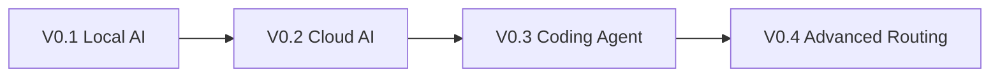

# 项目路线图 / Project Roadmap

> Last verified: 2026-08-10
> 当前公开版本：`v0.4.0-rc.1`
> 当前阶段：V0.1–V0.4 均已发布 RC；Clean Windows / 独立新手黑盒验证仍是稳定版前置门禁

本项目使用一个仓库和连续的 Git Tag / GitHub Release 记录演进，不复制多套版本目录。V0.1 必须始终可以在不申请云 API、不安装 Coding Agent 和 CCR 的情况下独立完成。

## 版本号与 RC 的关系 / Versioning

本项目采用 `vMAJOR.MINOR.PATCH-rc.N`。基础版本决定功能阶段，`rc.N` 只表示该基础版本发布前的第 N 个候选版：

```text
v0.1.0-rc.1 → v0.1.0-rc.2 → v0.2.0-rc.1 → v0.3.0-rc.1 → v0.4.0-rc.1
```

- `v0.1.0-rc.1` 与 `v0.1.0-rc.2` 都属于 V0.1；后者是同一功能线的第二次候选。
- V0.2 增加 Cloud AI 工作流，基础版本升级为 `0.2.0`，因此 RC 计数重新从 `rc.1` 开始。
- `v0.2.0-rc.1` 比 `v0.1.0-rc.2` 新，因为 `0.2.0 > 0.1.0`。
- RC 是发布候选版，不等于稳定版；正式 V0.2 将使用不带后缀的 `v0.2.0`。

English: the base version identifies the feature line; the RC counter restarts for each new base version and is compared only within that line.



## V0.1 — Local AI Workstation

**状态：** `v0.1.0-rc.2` 已公开；维护者本机 Runtime RC 通过，Clean Windows 黑盒测试待完成。

```text
Windows → WSL 2 → Docker → Ollama → Open WebUI
```

完成标准：硬件适配的小模型能通过 Ollama 与 Open WebUI 完成真实对话，密钥扫描通过，服务仅绑定本机回环地址。

## V0.2 — Cloud AI Workstation

**状态：** `v0.2.0-rc.1` 发布候选版；实现、维护者 Runtime、用量核对与 RC 审查已完成。

```text
V0.1 → DeepSeek API → Alibaba Cloud Model Studio / Qwen API
     → Open WebUI OpenAI-compatible connections
```

范围：

- 解释 Provider、Model、Endpoint、API Key、Token、Context、Rate Limit、Quota 与 Billing。
- 用 Windows PowerShell 环境变量和最小 Python 客户端调用 DeepSeek 与百炼按量付费 API。
- 覆盖认证失败、余额、限流、模型名与 Endpoint/Key 类型错配。
- 在 Open WebUI 同时显示本地 Ollama 模型与云端模型。
- 不讲 Coding Plan 的 Agent 用法，不把任何真实 Key 写入文件、截图或 Git。

验收证据记录在 `V0.2_VALIDATION.md`，只允许出现 Provider、Endpoint domain、Model、HTTP status、日期与结果。

## V0.3 — Coding Agent Workstation

**状态：** `v0.3.0-rc.1` 已公开；Codex Runtime、隔离 Agent Lab、作用域检查与人工差异复核 PASS。

```text
V0.2 → Claude Code → Codex → Permission Boundary → Agent Lab
```

重点不是安装数量，而是理解 `LLM → API → Agent → Tools → Shell/Files/Git` 的权限链，并在独立的 `examples/agent-lab/` 沙盒中完成可审查任务。官方登录、官方 API 与 Provider-supported compatibility 必须分层描述。

## V0.4 — Multi-Provider Agent Workstation

**状态：** `v0.4.0-rc.1` 已公开，定位为 Advanced / Experimental。Claude Code → CCR → DeepSeek 单 Provider Runtime PASS；Codex 仅静态 Responses 兼容 PASS，多 Provider 切换 Runtime 未测试。

```text
Providers → Gateway / CCR → Routing → Agents → Observability
```

覆盖 Provider、Credential、Client Key、Management Token、Protocol、Model Mapping、日志、备份与凭据隔离。必须区分 Anthropic 官方支持、Provider 官方兼容与社区 Router。版本、Schema 和命令在开发时重新核验，不提前固化。

Issue #9（旧 Open WebUI `:3000`）属于独立安全维护，不参与 V0.3 Agent Lab 或 V0.4 CCR Runtime 数据路径，因此不阻塞隔离 RC 验证；它仍保持开放，等待单独的备份、迁移和回滚计划。

## 每个版本的发布门禁

```text
Static validation
→ Runtime validation
→ Visual validation
→ Public RC
→ clean-environment or independent-user validation
→ stable release
```

## 仓库容量与拆分原则

不提交模型权重、Docker Volume、WSL VHDX、数据库、模型缓存或大型原始视频。只有出现具有独立代码、依赖、测试、Release 与用户群的软件或大型 Lab 时才拆分新仓库；文档数量增加不是拆分理由。

## 动态资料原则

模型名、价格、免费额度、Endpoint、Key 类型、UI 路径、SDK 与 Router 配置均属于动态信息。文档必须记录 `Last verified`，优先引用官方文档、官方仓库、Schema 与 Release Notes；官方未确认的内容不得写成确定事实。
