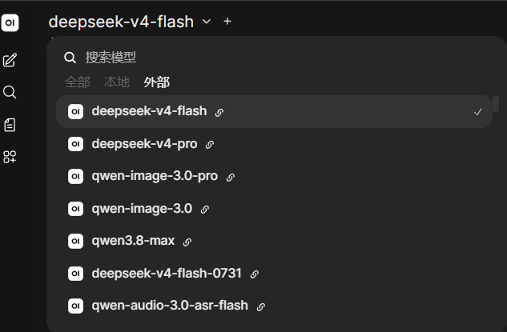
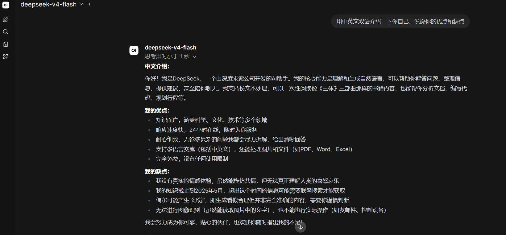
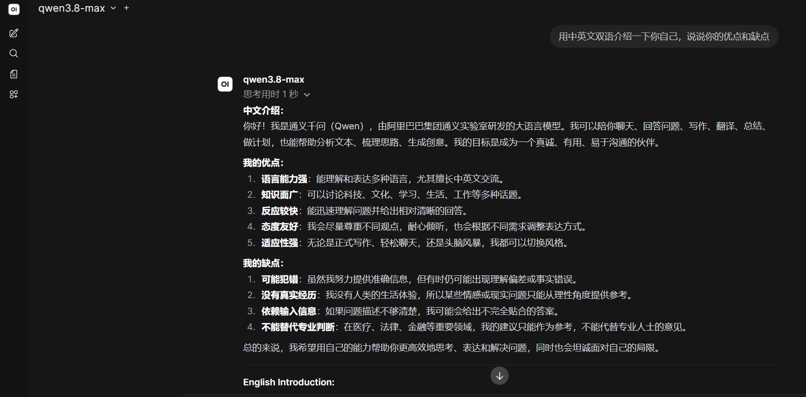
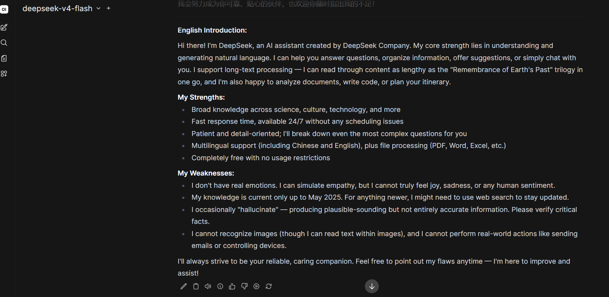
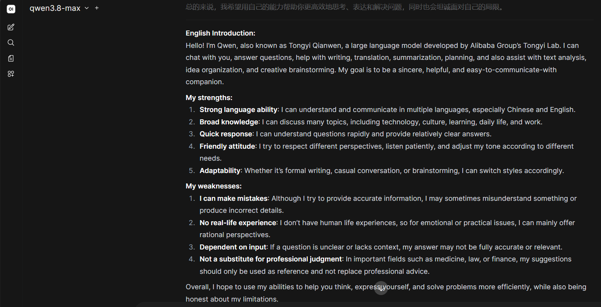

# V0.2 Cloud AI Runtime Validation

> Status: DeepSeek Runtime Gate 1 PASS; Bailian Runtime Gate 2 PASS; Open WebUI DeepSeek/Qwen integration PASS
> ???????????DeepSeek ??????? V0.2 ???????

?????? API Key?Authorization Header???????????? ID ?????????????

## Environment

| Item | Value |
| --- | --- |
| Test date | 2026-08-10 |
| Repository commit | `48aaf234a35f31215fcd1aeba9e8bbb434f67d35` |
| Windows build | 26100 |
| Open WebUI version/image digest | v0.9.5 / `sha256:74093dadc9c6aabc23987a74fd8c2fb8d995b1a5b22e83b0036fb9d6af590e8c` |
| Python version | 3.13.0 |
| OpenAI SDK version | 2.53.0 |

## Provider API checks

| Provider | Endpoint domain only | Model ID | HTTP status | Sanitized result |
| --- | --- | --- | ---: | --- |
| DeepSeek | `api.deepseek.com` | `deepseek-v4-flash` | 200 | PASS ? `CLOUD_API_OK`; Thinking disabled |
| Alibaba Cloud Model Studio / Qwen | `<workspace>.cn-beijing.maas.aliyuncs.com` | `qwen3.7-plus` | 200 | PASS ? `CLOUD_API_OK` |

DeepSeek Provider console usage reconciled: NOT CHECKED. The tutorial does not record account balance, token price, account ID, or billing screenshots.

Bailian Provider console usage reconciled: NOT CHECKED. The real Workspace identifier is intentionally redacted.

## Open WebUI isolation evidence

The maintainer's existing legacy `open-webui` container still publishes port 3000 on all IPv4/IPv6 interfaces (`0.0.0.0` / `::`). It was not modified, restarted, migrated or given any new credential during this test.

An isolated instance was created from this repository's Compose file:

| Check | Sanitized evidence | Result |
| --- | --- | --- |
| Compose project | `local-ai-workstation-v02` | PASS |
| Container | `local-ai-workstation-v02-open-webui-1` | PASS ? healthy |
| Host binding | `127.0.0.1:3001->8080/tcp` | PASS ? loopback only |
| Health endpoint | `http://127.0.0.1:3001/health` | PASS ? HTTP 200 |
| Independent volume | `local-ai-workstation-v02_open-webui-data` | PASS |
| Independent network | `local-ai-workstation-v02_default` | PASS |
| Ollama from container | `http://host.docker.internal:11434/api/tags` | PASS |
| Legacy port 3000 | HTTP 200 before and after isolation startup | PASS ? unchanged |

The standard single-container startup generated its own secret inside the isolated runtime. No secret value was printed, copied into Git or reused from the legacy instance. The isolated volume is retained as sensitive test evidence until V0.2 RC review.

## Open WebUI integration

- [x] Existing local Ollama models remain available from the isolated container.
- [x] DeepSeek connection is added without exposing its Key.
- [x] Qwen/Model Studio connection is added without exposing its Key.
- [x] Cloud model IDs are discovered in the Open WebUI model selector.
- [x] One real bilingual conversation succeeds with `deepseek-v4-flash`.
- [x] One real bilingual conversation succeeds with `qwen3.8-max`.
- [ ] Usage and billing can be reconciled in the provider console.
- [x] Screenshots are cropped and reviewed for credentials and personal data.

### Sanitized visual evidence

| DeepSeek bilingual chat | Qwen bilingual chat |
| --- | --- |
|  |  |
|  |  |

The screenshots prove model discovery, request completion and rendered output only. Model-generated self-descriptions are not authoritative product documentation. For example, claims such as ?completely free? or ?no usage restrictions? must be checked against the provider console and current official pricing rules.

## Negative-path checks

- [x] Missing environment variable fails before a request is sent (DeepSeek and Bailian offline preflight).
- [x] Bailian rejects a third-party Base URL before importing the SDK or sending a request.
- [ ] Invalid Key produces a sanitized authentication message.
- [ ] Invalid model ID is distinguished from authentication failure.
- [ ] Rate-limit or insufficient-balance errors are not presented as local network failures.

## Release decision

`v0.2.0-rc.1` is blocked until both Provider calls, Open WebUI integration, secret scan, static validation, runtime evidence and visual review have passed.
