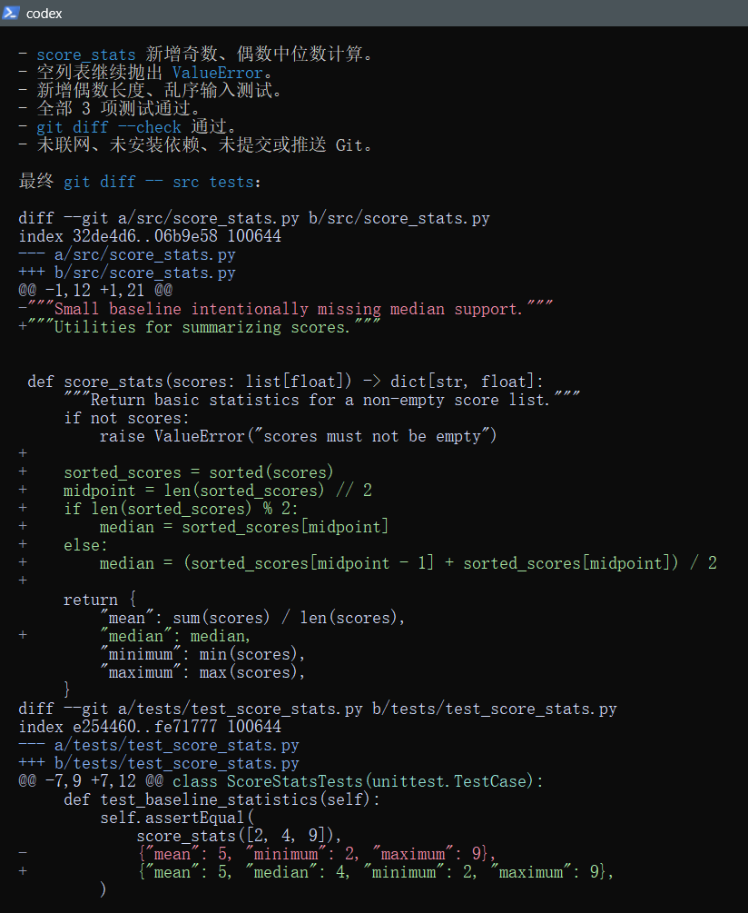

# V0.3 Validation / V0.3 验证记录

Last verified: 2026-08-10

## 中文

| 检查 | 状态 | 证据边界 |
| --- | --- | --- |
| 双语教程与本地链接 | PASS | 仓库静态检查 |
| Agent Lab 基线 | PASS | Python 标准库，3 agent-editable tests + repository-controlled semantic acceptance |
| 准备脚本 | PASS | Claude/Codex 独立临时 Git 副本 |
| Codex Agent Runtime | PASS | 普通 Windows PowerShell；隔离工作区；3 tests；作用域检查与人工 diff 复核通过 |
| Claude Code Runtime | DOCUMENTATION ONLY | 未提供 Anthropic 官方凭据；兼容路线需用户临时输入合法 Key |
| 旧 Open WebUI loopback 迁移 | INDEPENDENT SECURITY DEBT | 不属于 V0.3/V0.4 数据路径；不阻塞 RC，禁止在本次 Runtime 中改动 |

不记录登录身份、邮箱、Key、Token、完整用户路径、提示全文或账户页面。Runtime 成功必须同时满足测试通过、作用域检查通过和人工 `git diff` 复核。

### Codex Runtime 证据

- CLI: `codex-cli 0.147.0`
- Provider: `openai`
- Model reported by client: `gpt-5.6-sol`
- 沙箱：`workspace-write`，按需审批
- 任务：读取隔离工作区内的 `AGENT_TASK.md`，补充奇数/偶数中位数计算与测试
- 结果：3 agent-editable tests PASS；fixed semantic acceptance PASS；作用域检查 PASS；只修改 `src/` 与 `tests/`
- 安全边界：没有联网、安装依赖、提交、推送、访问 Open WebUI 或 Docker

## English

Static bilingual docs, links, the Agent Lab, and isolated workspace preparation pass. Codex completed the scoped median task from a normal Windows PowerShell session; both agent-editable tests and the repository-controlled semantic acceptance passed, followed by scope and diff review. It did not use networking, dependency installation, commits, pushes, Open WebUI, or Docker. Codex runtime is independent of Open WebUI. The legacy port-3000 instance remains separate security debt and is explicitly excluded from V0.3/V0.4 runtime. Claude Code remains documentation-only without an official Anthropic credential; its DeepSeek route is a community-compatible experiment, not an Anthropic-supported model route. Evidence excludes identity, credentials, full user paths, full prompts, and account pages.
