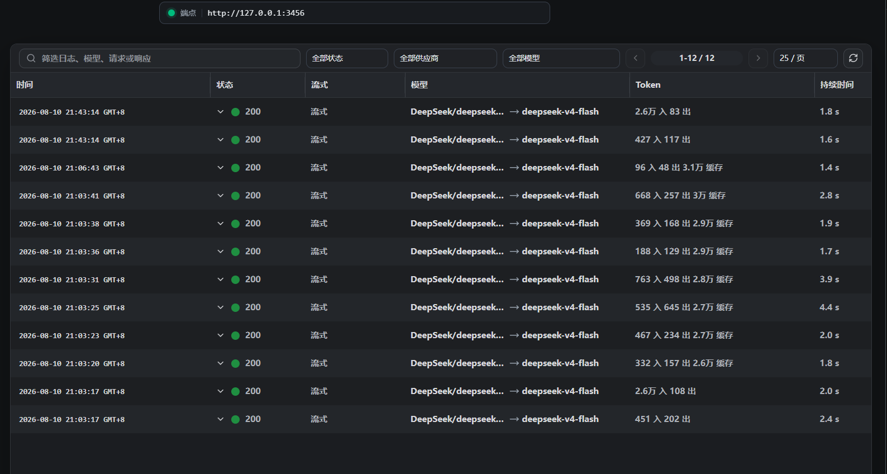
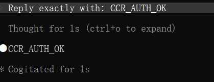
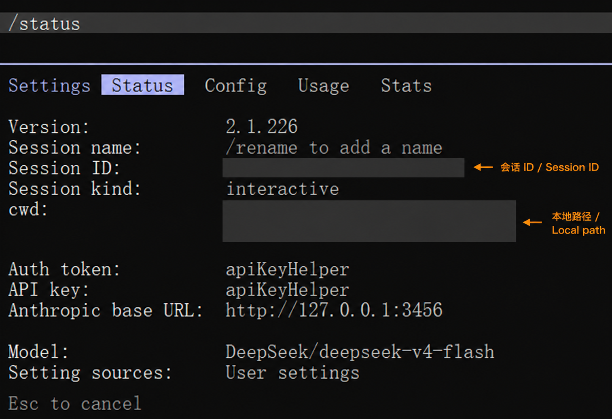

# V0.4 Validation / V0.4 验证记录

Last verified: 2026-08-10

| Gate | Status | Evidence boundary |
| --- | --- | --- |
| Bilingual architecture and security docs | PASS | Static repository checks |
| Official Windows Desktop | PASS | CCR 3.0.20 installed and launched; Gateway on `127.0.0.1:3456` |
| npm CLI install | PARTIAL | Metadata/help checked; persistent install blocked by native prebuild timeout |
| Official Docker build | BLOCKED BY NETWORK | Loopback Compose inspected; Docker Hub authentication timed out before resources were created |
| Claude Code client | PASS | Runtime re-verified on 2.1.226 |
| DeepSeek provider/model | PASS | `deepseek-v4-flash`; single-provider runtime only |
| Claude profile, Community / Experimental | PASS | “Only opened from CCR”; Agent Lab plus `CCR_AUTH_OK`; not Anthropic support |
| Codex Responses static compatibility | PASS | Generated config uses `wire_api = "responses"`, the only supported Codex provider wire API |
| Codex → CCR Runtime | NOT TESTED | Existing ChatGPT login, allowance, and system-default configuration intentionally protected |
| Multi-provider architecture | DOCUMENTED | Provider switching Runtime NOT TESTED |
| Credential-source hygiene | PASS | Parent-process cleanup removed inherited conflicting variables; `/status` reports `apiKeyHelper` and loopback Base URL |
| Secret scan and sanitized evidence | PASS | No credential, identity, full local path, management token, or request body published |

## Runtime summary / 运行摘要

- The first logged Agent Lab run produced **9/9 HTTP 200** CCR requests.
- After process-scoped authentication cleanup, the complete retained log showed **12/12 HTTP 200** requests, including `CCR_AUTH_OK`.
- This proves one route only: **Claude Code → CCR → DeepSeek**. It does not prove provider switching, load balancing, failover, or Codex Runtime.
- The right-side imported system-default Codex profile remained disabled.

## Context boundary / 上下文边界

DeepSeek’s official model page lists `deepseek-v4-flash` with a **1M context length** and **maximum 384K output** as of the verification date. Claude Code did not recognize the third-party model identifier and displayed a conservative **200K assumed context** warning. No `CLAUDE_CODE_MAX_OUTPUT_TOKENS`, model override, or `[1m]` suffix was applied because the full Claude Code → CCR → Provider path was not validated at 1M context. Provider capability and client/router operating limit are therefore documented separately.

Official dynamic source: [DeepSeek model and pricing page](https://api-docs.deepseek.com/zh-cn/quick_start/pricing). Recheck before future releases.

## 中文结论

Windows Desktop、loopback Gateway、DeepSeek 单 Provider、Claude Code 社区兼容 Runtime 与认证来源均通过。Codex 只完成 Responses 静态兼容检查，未进行 CCR Runtime；多 Provider 架构已写入教程，但切换 Runtime 未测试。V0.4 仍是 Advanced / Experimental 的评审候选，不是正式发布。

## English conclusion

Windows Desktop, the loopback gateway, the single DeepSeek provider, the community-compatible Claude Code runtime, and credential-source hygiene pass. Codex has static Responses compatibility only, not CCR runtime. Multi-provider architecture is documented, while switching runtime remains untested. V0.4 remains an Advanced / Experimental review candidate, not a release.

