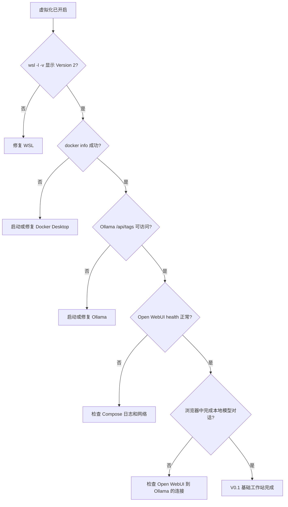

# 00. 路线、术语与架构 / Roadmap, Terms, and Architecture

## 先理解每个组件

| 组件 | 负责什么 | 不负责什么 |
| --- | --- | --- |
| BIOS/UEFI 虚拟化 | 允许硬件辅助虚拟化 | 不会自动安装 WSL 或 Docker |
| WSL 2 | 在 Windows 上提供轻量 Linux 环境 | 不是另一台物理电脑 |
| Ollama | 下载、管理和提供本地模型推理 API | 不是训练平台，也不是通用 Agent |
| Docker | 隔离应用依赖、网络和持久卷 | 不能自动保护你错误暴露的端口或令牌 |
| Open WebUI | 提供浏览器聊天与模型管理界面 | 不替代模型服务本身 |
| 百炼/DeepSeek | 云端模型 API | 不应接收无意上传的私密文件 |
| Claude Code | 在项目目录中理解、修改和运行代码 | 不应获得无限制主机权限 |
| 兼容路由层 | 在不同 API 协议/模型名之间适配 | 不是官方模型，也不保证服务条款兼容 |

## 四个信任边界

1. **主机边界**：Windows、个人文件和凭据。
2. **Linux 边界**：WSL 发行版与其软件包。
3. **容器边界**：Open WebUI 数据卷、端口和容器网络。
4. **云端边界**：发送给 API 服务商的提示词、代码片段与文件。

任何跨边界的数据都要问三个问题：发送了什么、发送给谁、能保存多久。

## V0.1 每一阶段的“门”

不要同时排查三层。底层健康检查失败时，上层报错通常只是连锁反应。

Cloud API、Coding Agent 与兼容路由是 V0.1 之后的独立增强路线，不是上图继续通过的必做关卡。

## English checkpoint

Treat the workstation as layered infrastructure. Verify one layer at a time and make every cross-boundary data flow explicit. Installation is not the goal; reproducible health checks are.

---

### 课程导航 / Course navigation

[← 课程首页 / Course home](../README.md) | [下一篇：开启虚拟化与 WSL 2 / Next: Virtualization and WSL 2 →](01-virtualization-wsl.md)
