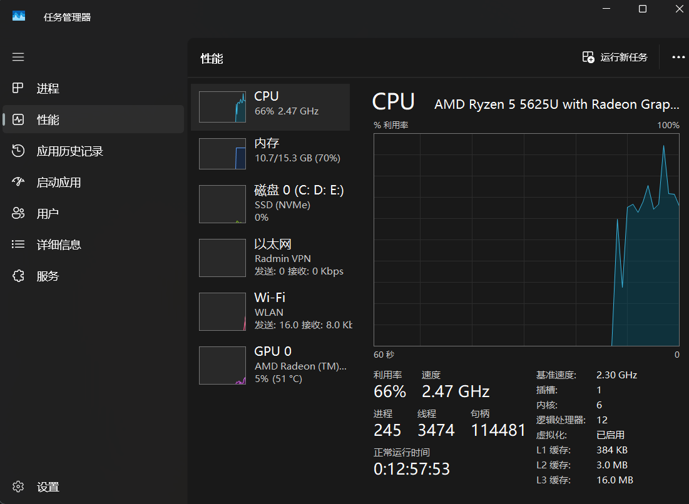
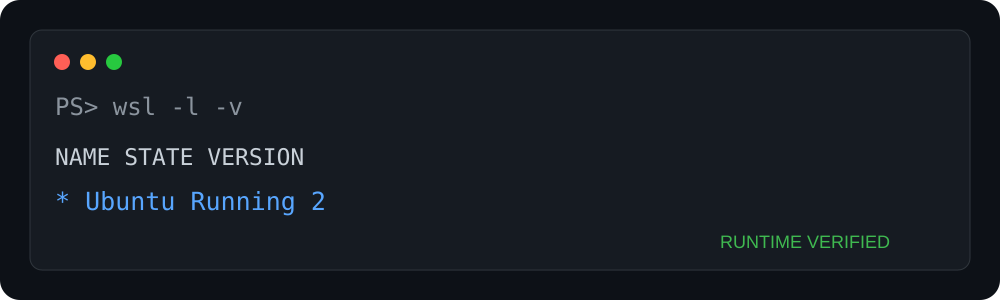

# 01. 开启虚拟化与安装 WSL 2

## 本章目标与前置条件

从一台尚未安装 WSL 的 Windows 电脑开始，完成虚拟化检查、Ubuntu 安装和 WSL 2 验收。本章只需要 Windows 管理员权限和网络连接，不要求预先安装 Git、Python、Docker 或 Ollama。

> 命令环境：除“更新 Ubuntu”小节明确标注为 **WSL Ubuntu / Bash** 外，本章命令均在 **Windows PowerShell** 中运行。

## 1. 检查虚拟化

打开任务管理器 → 性能 → CPU，查看“虚拟化”是否为“已启用”。若未启用，重启进入 BIOS/UEFI，寻找 Intel VT-x/VT-d 或 AMD-V/SVM。菜单名称因厂商而异；修改前记录原设置，不要改动不相关的安全和存储选项。



图中“虚拟化：已启用”位于 CPU 详情区域。Windows 版本更新后布局可能不同，关键是该状态文字，不需要与截图的 CPU 使用率或其他设备信息一致。

## 2. 安装 WSL

以管理员身份打开 Windows PowerShell：

```powershell
wsl --install -d Ubuntu
wsl --update
wsl --set-default-version 2
```

重启后首次打开 Ubuntu，创建独立的 Linux 用户和密码。该密码不会在输入时显示字符，这是正常行为。

```powershell
wsl --status
wsl --list --verbose
```

验收目标：Ubuntu 的 VERSION 为 `2`。



运行证据摘要展示了本项目测试机上的成功状态。不同语言的 Windows 输出排版可能不同，关键是目标 Ubuntu 的 `VERSION` 为 `2`。

## 3. 更新 Ubuntu

从开始菜单打开 Ubuntu。以下命令在 **Ubuntu 的 Bash 终端**运行，不是在 PowerShell：

```bash
sudo apt update
sudo apt upgrade -y
```

V0.1 基础聊天路线暂不需要在 Ubuntu 中安装 Git、Python、Node.js 或编译工具。后续章节确实需要时再安装，避免让新手误以为它们是 Docker/Ollama 的前置条件。

## 4. 文件放在哪里

- Linux 工具链项目优先放在 `~/projects`，性能和权限语义更稳定。
- Windows 文件通过 `/mnt/c`、`/mnt/d` 访问。
- 不要让 Windows 与 Linux 两套工具同时写入同一个数据库或模型缓存。
- 大模型文件很大，提前确认 WSL 虚拟磁盘与宿主盘剩余空间。

## 5. 网络理解

WSL、Windows 和 Docker Desktop 之间并非永远共享同一个 `localhost` 语义。教程 Compose 使用 `host.docker.internal` 让容器访问 Windows 宿主的 Ollama。若 Ollama 安装在 WSL 内，网络地址与启动方式需要相应调整。

## 常见失败

| 现象 | 处理 |
| --- | --- |
| `0x80370102` | 检查 BIOS 虚拟化和“虚拟机平台”功能 |
| WSL 版本为 1 | `wsl --set-version Ubuntu 2` |
| 安装后要求重启 | 完成重启再继续，不要跳过 |
| `/mnt/*` 很慢 | 将高 I/O 项目移动到 WSL 的 Linux 文件系统 |

官方参考：[Microsoft WSL installation](https://learn.microsoft.com/windows/wsl/install)。

## 完成后的状态与下一步

成功现象：`wsl --list --verbose` 能看到 Ubuntu，且 `VERSION` 为 `2`；Ubuntu 能正常执行 `sudo apt update`。完成后进入 [Docker 基础与 WSL 2 后端](03-docker.md)。如果安装命令要求重启，必须重启并重新验收后再继续。
