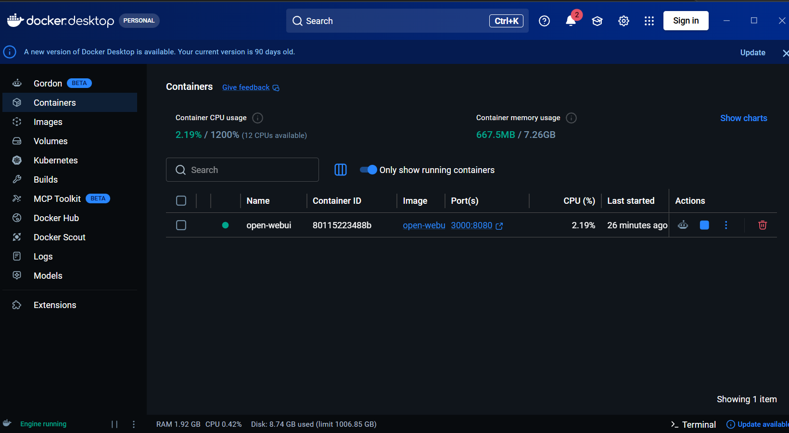
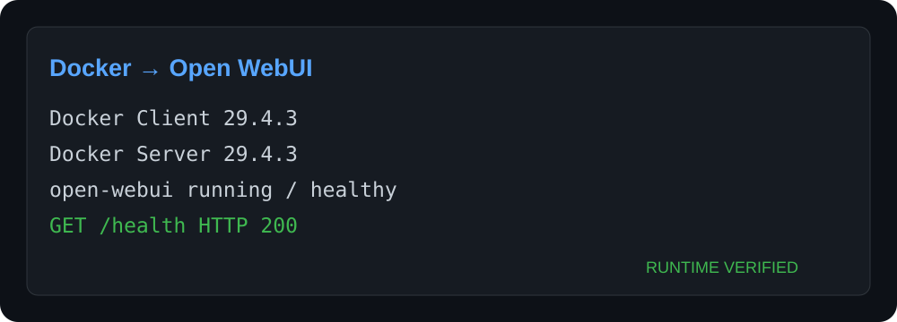

# 03. Docker 基础与 WSL 2 后端

## 本章目标

- 理解 Image、Container、Volume、Port 和 Network。
- 安装或检查 Docker Desktop 的 WSL 2 后端。
- 运行一个可删除的验证容器，不触碰现有数据卷。
- 能分辨“安装了 Docker CLI”和“Docker Engine 正在运行”。

## 前置条件与命令环境

- 已完成 [WSL 2 章节](01-virtualization-wsl.md)，Ubuntu 的 VERSION 为 2。
- 拥有 Windows 软件安装权限。
- 除明确标注为 WSL Bash 的代码块外，命令都在 **Windows PowerShell** 运行。
- 执行本仓库的 Compose 命令时，必须先进入包含 `docker-compose.yml` 的仓库根目录。

## 原理简介

可以把宿主机理解为公寓楼，Image 是装修模板，Container 是按模板创建的房间，Volume 是独立储物间，Port 是访客入口，Network 是房间之间的走廊。

| 概念 | 含义 | 初学者常见误区 |
| --- | --- | --- |
| Image | 只读应用模板 | 下载镜像不等于服务已经运行 |
| Container | 镜像的一次运行实例 | 删除容器不一定删除 Volume |
| Volume | Docker 管理的持久数据 | `docker compose down -v` 会删除卷，需谨慎 |
| Port | 宿主端口到容器端口的映射 | `3000:8080` 左边是宿主端口 |
| Network | 容器和宿主间的通信边界 | 容器内 `localhost` 指容器自己 |

## Docker Desktop 与 WSL 2

Windows 主线推荐 Docker Desktop 使用 WSL 2 backend。Docker Desktop 管理 Linux VM/发行版和 Engine，Windows 与已启用集成的 WSL 发行版可以使用 Docker CLI。

从 [Docker Desktop 官方安装文档](https://docs.docker.com/desktop/setup/install/windows-install/) 获取 Windows 安装方式，并按 [WSL 2 backend 文档](https://docs.docker.com/desktop/features/wsl/) 启用 WSL 2 后端。安装后启动 Docker Desktop，等待 Engine 就绪。若本机已安装，不要为了跟教程一致而重装。



维护者机器的 Docker Desktop 已显示 `Engine running`，并能看到运行中的 `open-webui` 容器。版本、菜单和更新提示会变化；判断成功应以 Engine 正常、`docker version` 有 Server、目标容器可用为准。截图中的既有容器端口配置不是教程安全默认值，教程 Compose 仍只绑定 `127.0.0.1`。

## 验证步骤

### Windows PowerShell

```powershell
docker --version
docker compose version
docker version
docker info
```

前两条只证明 CLI/Compose 存在；`docker version` 同时出现 Client 和 Server，`docker info` 成功，才说明 Engine 可用。



这是维护者机器的真实运行结果摘要。Docker Desktop 界面会随版本变化，不必逐像素匹配；应以 Client/Server 都可用、容器状态和健康检查为准。

### WSL Bash

```bash
docker --version
docker info
```

若 Windows 可用但 WSL 不可用，在 Docker Desktop → Settings → Resources → WSL Integration 中检查目标 Ubuntu 是否启用。

## 最小容器实验

```powershell
docker run --rm hello-world
```

`--rm` 表示进程结束后自动删除这个验证容器，不会删除其他容器或 Volume。

再观察状态：

```powershell
docker ps
docker ps -a
docker image ls
```

## Compose 基础

本仓库的 `docker-compose.yml` 描述 Open WebUI 服务、端口、环境变量、持久卷与健康检查：

```powershell
# 先进入本仓库根目录；将路径替换为你的实际位置
Set-Location "<仓库所在目录>"
```

```powershell
docker compose config
docker compose up -d
docker compose ps
docker compose logs --tail 100 open-webui
docker compose stop
docker compose start
```

安全停止并保留数据：

```powershell
docker compose down
```

不要随意运行 `docker compose down -v`，其中 `-v` 会请求删除 Compose Volume，可能连同聊天记录一起删除。

## 常见问题

| 现象 | 原因与处理 |
| --- | --- |
| 找不到 named pipe / daemon | Docker Desktop 没启动，或 Linux Engine 尚未就绪 |
| 只有 Client、没有 Server | CLI 已安装但 Engine 未运行 |
| WSL 内无权限 | 检查 Docker Desktop 的 WSL Integration，不要盲目 `chmod 777` |
| 端口被占用 | `Get-NetTCPConnection -LocalPort 3000` 查找占用，或修改宿主端口 |
| 磁盘快速增长 | 检查镜像、Build Cache 和 Volume；清理前先确认目标 |

## 完成后的状态

成功现象：`docker info` 同时显示可用 Server 信息，`docker run --rm hello-world` 输出成功消息，并且你能解释为什么容器内的 `localhost` 不是 Windows 宿主机。下一步进入 [Ollama 本地模型服务](04-ollama.md)。
