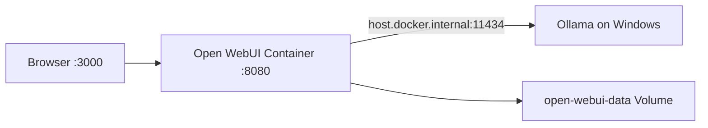
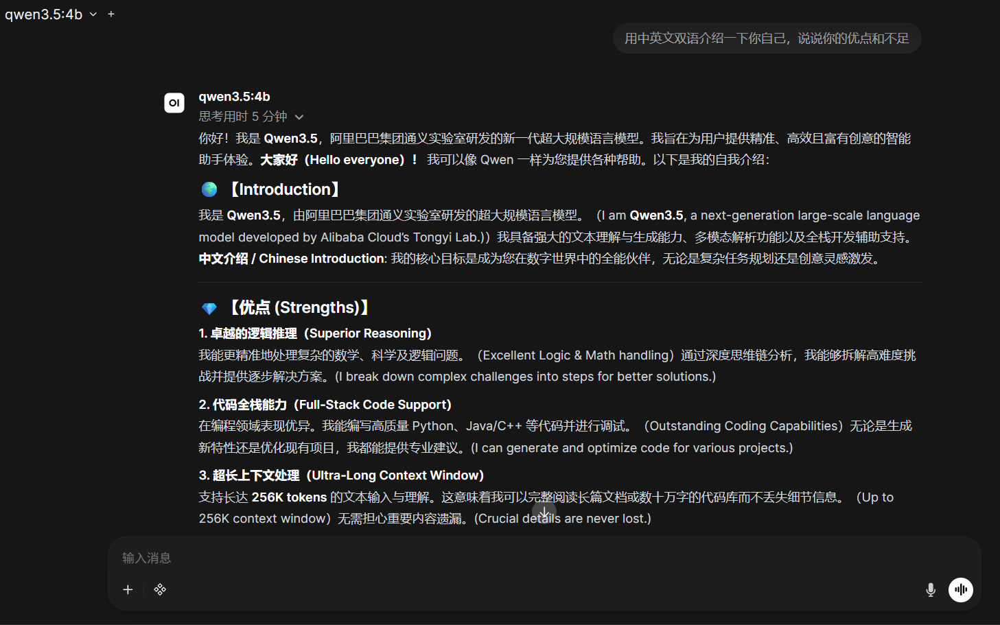
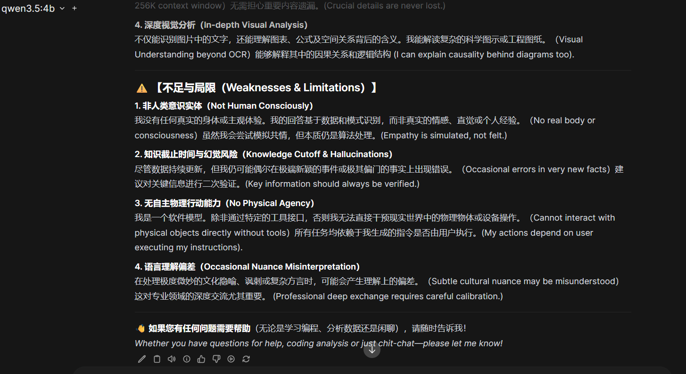

# 05. 用 Docker 部署 Open WebUI

> Last verified: 2026-08-09  
> 核验时最新 GitHub Release 为 v0.11.0；仓库未声称已在本机完整验证该版本。

## 本章目标

- 用 Compose 启动 Open WebUI。
- 让容器访问 Windows 宿主机上的 Ollama。
- 理解账户、端口和 Volume 的安全含义。
- 掌握更新前备份、日志检查和无损停止。

## 前置条件与命令环境

- `docker info` 可正常返回 Server 信息。
- Windows Ollama API `http://127.0.0.1:11434/api/tags` 可访问，且至少有一个本地模型。
- 已下载或克隆本仓库，并在 **Windows PowerShell** 中进入包含 `docker-compose.yml` 的仓库根目录。
- 本章基础路线不需要任何云 API Key。

## 架构



Compose 默认将宿主的 `127.0.0.1:3000` 映射到容器 `8080`；可在 `.env` 中用 `OPEN_WEBUI_PORT` 改宿主端口。仅绑定 `127.0.0.1` 可避免默认暴露到局域网或公网。Compose 自动管理容器名，项目专属的 `open-webui-data` Volume 保存账户、设置和聊天数据。

## 启动前检查

```powershell
# Windows PowerShell；先确认当前位置是仓库根目录
Get-Location
Test-Path .\docker-compose.yml
Invoke-RestMethod http://127.0.0.1:11434/api/tags
docker info
Copy-Item .env.example .env
docker compose config
```

`.env` 已被 `.gitignore` 排除。当前 Compose 只需要 Ollama 地址；不要因为有空白云 Key 就把真实 Key 全部填进去。

## 启动

```powershell
docker compose pull
docker compose up -d
docker compose ps
docker compose logs --tail 100 open-webui
```

浏览器打开 <http://localhost:3000>。首次注册账户只存在你的本地 Volume 中。若页面能打开但没有模型，按以下顺序检查：

1. Windows 上 Ollama API 是否正常。
2. Compose 中 `OLLAMA_BASE_URL` 是否为 `http://host.docker.internal:11434`。
3. 容器日志是否出现连接拒绝或超时。
4. Ollama 是否只监听了容器无法访问的地址。

### 成功界面参考



模型名出现在左上角且回复能够正常生成，说明浏览器 → Open WebUI → Ollama → 本地模型主链已经可用。下面是同一次回复中对局限性的继续说明：



相比只输出 `LOCAL_AI_OK`，这类自然回复更适合展示实际使用体验；但本次回复在维护者的无独显轻薄本上显示“思考用时 5 分钟”，因此它同时也是“可以运行不等于运行流畅”的实例。这个时间没有经过控制变量，不是通用 Benchmark。模型对自身能力、上下文或知识范围的自述仍需以模型库、运行配置和独立测试为准，不能直接当成技术规格。

## 日常操作

```powershell
docker compose stop
docker compose start
docker compose restart open-webui
docker compose logs -f open-webui
```

停止与删除容器但保留 Volume：

```powershell
docker compose down
```

## 更新与备份原则

Open WebUI 当前文档定义：

- `:main`：官方快速开始使用的标准滚动镜像。
- `:latest`：与 `:main` 指向同一滚动构建，不是不可变的“最新稳定版”。
- `:vX.Y.Z`：固定 Release，适合记录和复现经过验证的环境。

本仓库 `.env.example` 默认使用 `:main` 便于新手体验。长期环境应将 `OPEN_WEBUI_IMAGE` 改为自己实际测试过的版本标签，并记录测试日期。更新前阅读 [Open WebUI quick start](https://docs.openwebui.com/getting-started/quick-start/) 和 Release Notes。

更新前至少记录：

```powershell
docker compose images
docker volume ls
docker inspect $(docker compose ps -q open-webui)
```

不要把 Volume 目录、聊天导出或数据库提交到 Git。备份方式应以 Open WebUI 当前官方文档为准，并在副本上验证恢复。

## 接入云 API

当前核验界面路径：

```text
Admin Settings → Connections → OpenAI → Add Connection
```

填写 OpenAI-compatible URL 与 API Key。若 Provider 不支持 `/models` 自动发现，可使用 Model IDs Filter 手工限定模型。界面会随版本变化，以 [Open WebUI provider guide](https://docs.openwebui.com/getting-started/quick-start/connect-a-provider/starting-with-openai-compatible/) 为准。

容器访问宿主机 Provider 时不能把 `localhost` 简单当成 Windows；根据本仓库架构使用 `host.docker.internal`。

## 健康检查

Open WebUI 官方监控文档确认 `/health` 无需认证，服务正常时返回 HTTP 200。本仓库 Compose 已使用该路径：

```powershell
Invoke-WebRequest http://localhost:3000/health
```

这只验证 Web 服务与基础数据库初始化，不证明 Ollama/云模型可用；模型连接需要登录后的 `/api/models` 或一次真实对话验证。

## 常见问题

| 现象 | 处理 |
| --- | --- |
| `localhost:3000` 无法访问 | 检查 `docker compose ps`、端口占用和日志 |
| 页面正常但无 Ollama 模型 | 检查 `host.docker.internal` 与 Ollama 监听地址 |
| 更新后数据消失 | 检查是否错误删除/更换 Volume；停止继续写入并从备份恢复 |
| 其他电脑能访问 | 检查端口是否从 `127.0.0.1` 改成了 `0.0.0.0` |
| 容器反复重启 | 查看健康检查和应用日志，不要直接删除 Volume |

## 完成后的状态

成功现象：浏览器能够登录 Open WebUI，看到 Ollama 模型并完成一次对话；`docker compose down` 后再次 `up -d`，本地账户与聊天仍由同一 Volume 保存。至此 V0.1 基础 AI 工作站完成；[云 API](06-cloud-api.md)、[Coding Agent](07-agent-basics.md) 和 CCR 都是后续选做增强。
