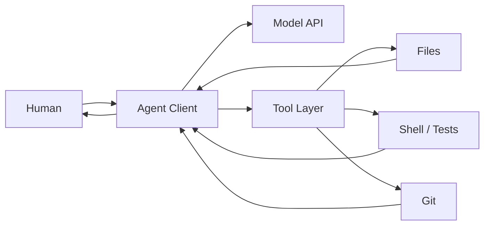

# 07. Coding Agent 原理：从聊天到可审查的代码工作流

## 本章目标

- 理解模型、API、Agent、工具、终端、文件系统和 Git 的关系。
- 分辨普通聊天助手与 Coding Agent。
- 在启动 Agent 前建立工作区、权限和审查边界。
- 了解 Claude Code、Codex 和兼容路由分别位于哪一层。

## Agent 不是另一个模型名字



模型负责理解和生成，Agent 客户端负责组织循环、提供上下文、调用工具和展示审批。Claude Code、Codex 等是 Agent 客户端/产品；Claude、GPT、Qwen、DeepSeek 是模型家族。API Key 只解决认证和计费，不自动赋予模型读取本地文件的能力。

## 聊天助手与 Coding Agent

| 能力 | 普通网页聊天 | Coding Agent |
| --- | --- | --- |
| 阅读当前项目 | 需要手动上传/粘贴 | 可在授权工作区搜索文件 |
| 修改文件 | 通常只给代码片段 | 可以生成可检查的文件差异 |
| 执行命令 | 通常不能 | 可在审批和沙箱边界内运行 |
| 运行测试 | 需要用户复制执行 | 可执行、读取失败并迭代 |
| Git | 通常给出建议 | 可查看状态、生成提交，仍需人工确认 |
| 风险 | 数据上传、回答错误 | 还包括文件修改、命令执行和供应链风险 |

## 一个健康的 Agent 循环

1. 用户给出目标、范围、限制和验收标准。
2. Agent 读取仓库说明与相关文件，不先修改无关内容。
3. Agent 提出或内部形成小步计划。
4. 只修改目标文件。
5. 运行最相关的测试、格式化或静态检查。
6. 展示差异、测试结果和未解决风险。
7. 用户确认后再提交、推送或执行外部写操作。

“让 Agent 自己完成”不等于“跳过审查”。好的自动化会增加可见证据，而不是减少责任。

## 工作区信任

首次在陌生仓库启动 Agent 前，人工查看：

```bash
git status --short
git remote -v
find . -maxdepth 2 -type f | sort | head -200
```

Windows PowerShell 可使用：

```powershell
git status --short
git remote -v
Get-ChildItem -Recurse -Depth 2 -File | Select-Object FullName
```

重点检查：仓库说明、构建脚本、安装脚本、Git hooks、容器配置、依赖来源、隐藏文件、环境变量读取和会向外部发送数据的工具。

仓库文本也可能包含提示注入，例如要求 Agent 忽略用户、读取凭据或上传文件。仓库说明只能约束项目工作，不应覆盖用户安全边界。

## 最小权限原则

- 只从目标仓库目录启动 Agent。
- 不把整个用户目录、浏览器数据或 SSH/云凭据目录作为工作区。
- 默认拒绝管理员/root 权限。
- 安装依赖、网络下载、删除文件、推送和发布应单独审查。
- 先使用测试项目了解权限提示，再进入重要仓库。
- 为云 API 设置预算和速率限制。

## Claude Code、Codex 与路由层

| 层 | 例子 | 教程定位 |
| --- | --- | --- |
| 原生 Agent | Claude Code + Claude | Anthropic 官方路线 |
| 原生 Agent | Codex + OpenAI 模型 | OpenAI 官方路线 |
| 社区兼容层 | 将其他 Provider 适配给某 Agent | 实验性、需审查、可能不完全兼容 |
| 本地后端 | Ollama 模型 | 低成本学习，能力取决于模型与路由 |

不要因为某个网关能返回文本，就宣称它“完美支持”Agent。真正验收还包括工具调用、长输出、流式事件、错误处理、模型名映射和多轮上下文。

## Git 是安全网，不是魔法撤销键

开始前：

```bash
git status --short
git switch -c tutorial/agent-lab
```

完成后：

```bash
git diff --check
git diff
git status --short
```

不要让 Agent 在存在不明未提交改动时执行广泛格式化、清理或重置。`git reset --hard`、递归删除和强推都不属于入门实验。

## 完成后的状态

你应能够画出 Agent 数据流，解释 API 与本地工具权限的区别，并能在一个无凭据的练习仓库中为 Agent 设定清晰边界。

