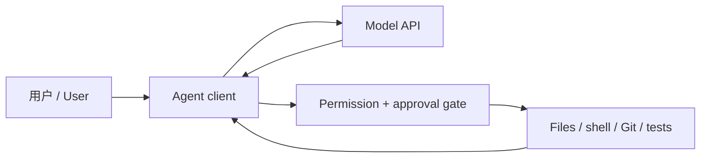

# V0.3 Coding Agent 基础 / Coding Agent Foundations

[中文](#中文) | [English](#english) · Last verified: 2026-08-10

## 中文

V0.3 把 V0.2 的模型调用升级为受控的软件代理工作流：模型负责判断下一步，Agent 客户端把建议转换为读文件、编辑、运行测试和查看 Git 差异等工具调用，操作系统最终执行。模型并不天然拥有电脑权限；权限来自你启动 Agent 时授权的目录、沙箱、网络和审批策略。

推荐顺序：先读[心智模型](agents/agent-mental-model.md)和[权限安全](agents/permissions-security.md)，再选择 [Claude Code](agents/claude-code.md) 或 [Codex](agents/codex.md)，最后完成[隔离实验](agents/agent-lab.md)。V0.3 不需要 CCR；路由属于 V0.4 高级实验。

## English

V0.3 turns V0.2 model calls into a controlled software-agent workflow. The model proposes actions, the agent client translates them into file, shell, test, and Git tools, and the operating system executes them. A model has no inherent computer access; effective authority comes from the workspace, sandbox, network, and approval policy you grant at launch.

Read the [mental model](agents/agent-mental-model.md) and [permission guide](agents/permissions-security.md), choose [Claude Code](agents/claude-code.md) or [Codex](agents/codex.md), then run the [isolated lab](agents/agent-lab.md). CCR is not required for V0.3.

---

### 课程导航 / Course navigation

[← 上一篇：Cloud 故障排查 / Previous: Cloud troubleshooting](cloud/troubleshooting.md) | [课程首页 / Course home](../README.md) | [下一篇：V0.3 Agent 子课程 / Next: Agent module →](agents/README.md)
