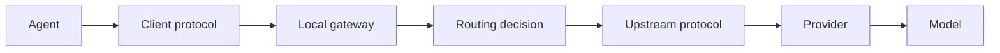

# 13. V0.4 路由 / V0.4 Routing

[中文](#中文) | [English](#english) · Dynamic information last verified: 2026-08-10

## 中文

V0.4 是高级、社区实验路线，不是完成本地工作站或 Coding Agent 的必要条件。

本教程选择 Claude Code Router（CCR）作为社区实现案例。它不改变支持边界：厂商官方、Provider 官方兼容与社区 Router 必须分层表述。先读[路由导航](routing/README.md)，完成单 Provider 单模型后再做手动切换、Profile、规则和可观测性。

## English

V0.4 is an advanced community experiment, not a prerequisite for the local workstation or coding agents. It uses Claude Code Router as one implementation example while preserving the distinction between vendor support, provider-supported compatibility, and community routing. Start with one provider, one model, and one agent before profiles or rules.

---

### 课程导航 / Course navigation

[← 上一篇：最终验收 / Previous: Acceptance](12-acceptance.md) | [课程首页 / Course home](../README.md) | [下一篇：V0.4 Routing 子课程 / Next: Routing module →](routing/README.md)
