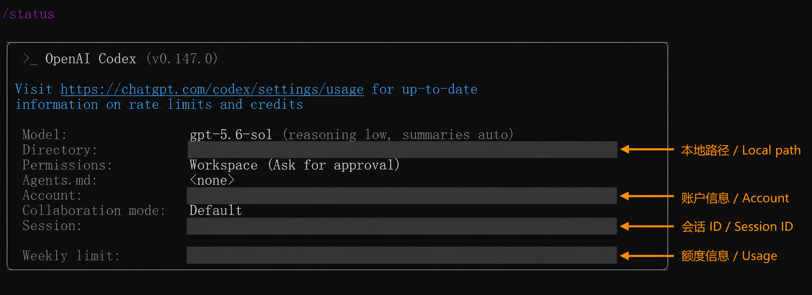

# Codex 安全接入 / Safe Codex Setup

[中文](#中文) | [English](#english) · Last verified: 2026-08-10

## 中文

本机验证版本为 `codex-cli 0.147.0`。Codex 可以使用 ChatGPT 账号登录；这与 OpenAI API Platform 的 API Key、余额和速率限制不是同一套授权。教程不读取、导出或展示 Codex 的认证文件、邮箱或订阅页面。

```powershell
powershell -ExecutionPolicy Bypass -File .\scripts\prepare-agent-lab.ps1 -Agent codex
Set-Location .\.agent-runtime\codex
codex exec --sandbox workspace-write "Read AGENT_TASK.md and complete only that task. Do not use network, install packages, commit, or push. Run all tests and show git diff -- src tests."
```

运行前用 `codex --help` 和 `codex exec --help` 核对当前参数。不要添加 `--search`、跳过审批或危险全权限选项。自定义 Provider 属于高级配置；当前 Codex 需要 Responses-compatible 路径。若 Router 只生成 `wire_api = "chat"`，应判定兼容性阻塞，不应降级客户端。

公开运行截图前，必须用不透明实心块移除本地路径、账户、会话 ID 和额度信息；仅做模糊或低强度像素化并不可靠。下面的双语标注图只说明应遮挡的位置，不公开任何原值。



## English

The locally inspected version is `codex-cli 0.147.0`. ChatGPT sign-in is separate from API Platform keys, balances, and rate limits. This tutorial never reads or exports Codex authentication files or account identity.

Prepare the lab and run the command above only after checking current help output. Do not add web search, approval bypass, or unrestricted-access flags. A custom provider is advanced and must support the current Responses path; a profile that only emits `wire_api = "chat"` is a compatibility blocker, not a reason to downgrade Codex.

Before publishing runtime screenshots, replace local paths, account details, session IDs, and usage data with fully opaque blocks. Blur or weak pixelation is not a dependable redaction method. The annotated example above identifies redaction zones without exposing their original values.

## Official references / 官方资料

- [Codex CLI reference](https://developers.openai.com/codex/cli/reference)
- [Codex security](https://developers.openai.com/codex/security)
- [Codex configuration](https://developers.openai.com/codex/config-reference)
- [Codex with a ChatGPT plan](https://help.openai.com/en/articles/11369540-codex-and-chatgpt-plan-usage-limits)
