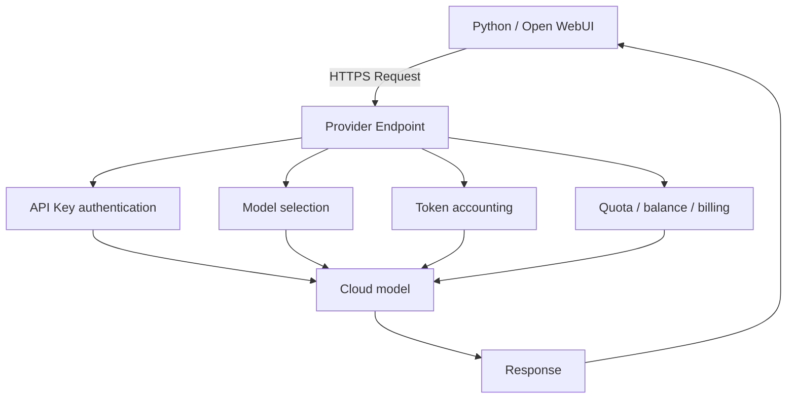

# 云 API 基础：先理解账单与信任边界

> Last verified: 2026-08-10  
> V0.2 Implementation Phase 1 · 对应 Issue #1

## 本章目标

完成本章后，你应当能解释 Provider、Model、Base URL、Endpoint、API Key、Token、Context、Rate Limit、Quota、Balance 与 Billing，并理解为什么网页会员、API 平台、Key 和模型不是同一件事。

## 四个最容易混淆的层级

```text
网页聊天产品 ≠ API Platform ≠ API Key ≠ Model
```

| 名称 | 它是什么 | 它不自动代表什么 |
| --- | --- | --- |
| 网页聊天产品 | 面向用户的聊天网站或订阅服务 | 不自动赠送同额度 API |
| API Platform | 创建 Key、查看用量、余额和账单的平台 | 不是某一个模型 |
| API Key | 调用 API 的凭据，通常关联账户/项目/地域/权限/账单 | 不是网页密码，也不能跨 Provider 通用 |
| Model | 请求中选择的云模型或模型别名 | 不决定 Key 属于谁或从哪里计费 |

具体例子：

- DeepSeek 网页聊天不等于 DeepSeek API 余额。
- ChatGPT 订阅不等于 OpenAI API Platform 余额。
- 阿里云百炼是模型服务平台；Qwen / 通义千问是模型家族。
- 本地 Ollama 模型不需要云 API Key，但消耗本机算力；云 API 消耗 Provider 侧配额或余额。

## API 数据流与新的信任边界



V0.1 的主要链路留在本机：

```text
Open WebUI → localhost → Ollama → Local Model
```

V0.2 的云链路跨越互联网：

```text
Open WebUI / Python → HTTPS → Provider API → Cloud Model
```

> [!IMPORTANT]
> 从 V0.2 开始，发送给云模型的 Prompt、对话历史以及你主动附带的文件内容会离开本机并交给云服务商处理。不要发送密钥、私人文件、未脱敏客户数据或你无权上传的内容；使用前阅读 Provider 当前隐私、保留和使用条款。

## 术语表

### Provider 与 Model

**Provider** 运营 API、认证、网络、配额和账单。**Model** 是请求希望调用的模型 ID。一个 Provider 可能提供多个模型，也可能代理第三方模型；模型名会升级、改别名或退役。

当前教程把模型 ID 作为配置，而不是永久写死在代码中。第三方客户端文档里的示例若与 Provider 当前模型目录冲突，以 Provider 官方模型目录或其 `/models` 实时结果为准。

### Request 与 Response

**Request** 通常包含模型 ID、消息、输出限制和可选参数，并通过 HTTPS 发送。**Response** 包含模型输出、结束原因、用量信息和服务端请求 ID等。认证 Header 不应进入日志或截图。

### Input Token 与 Output Token

Token 是模型处理文本时使用的计量单位，不等同于字符或单词。

- **Input Token**：系统提示、用户消息、历史上下文和工具描述等输入。
- **Output Token**：模型生成的回答以及 Provider 计费规则覆盖的其他输出。

不同模型、缓存、Thinking 和工具调用可能采用不同价格。不要用某次活动价格推断长期成本。

### Context

Context 是一次请求可处理的信息范围，通常包含输入和输出。模型页面标注的最大 Context 不等于你每次都应该用满；更长上下文通常意味着更多 Token、成本和等待时间。

### Rate Limit、Quota、Balance 与 Billing

- **Rate Limit**：单位时间内允许的请求数或 Token 数；超过时常见 HTTP 429。
- **Quota**：账户、项目、模型或活动允许使用的额度；可能有有效期和适用范围。
- **Balance**：可用于按量付费的资金或信用余额；不足不等于网络故障。
- **Billing**：Provider 如何按输入、输出、缓存或其他能力计算费用。

网页订阅、免费额度、API 余额和限流是四件不同的事。使用真实请求前应设置费用提醒或限制，并在 Provider 控制台核对实际用量。

## Base URL 与完整 Endpoint

Base URL 是 SDK 拼接 API 路径时使用的根地址；Endpoint 是实际 HTTP 请求地址。

以 DeepSeek 当前 OpenAI-compatible 接口为例：

```text
Base URL:      https://api.deepseek.com
HTTP Endpoint: https://api.deepseek.com/chat/completions
```

Python SDK 配置的是 Base URL：

```python
OpenAI(base_url="https://api.deepseek.com")
```

调用 `client.chat.completions.create(...)` 时，SDK 再请求 Chat Completions 路径。不要把完整 `/chat/completions` URL 当作 `base_url` 复制进去。不同 Provider 是否需要 `/v1`、Workspace ID 或地域域名，以其当前官方文档和控制台为准。

## API Key 不只是一个密码字符串

Key 往往同时绑定或受以下条件约束：

```text
Provider
Account / Project / Workspace
Region
Protocol / Endpoint
Permission
Quota
Billing
```

所以格式看起来正确的 Key，不代表能在任意 Endpoint 使用。不要尝试把 DeepSeek Key 用于百炼，也不要假设百炼不同地域、Workspace、普通按量 Key 与套餐 Key 可以互换。

教程示例只使用 `YOUR_API_KEY` 或 `<YOUR_API_KEY>` 这类占位符。真实 Key 只在当前 Shell 中通过环境变量注入，不写入代码、Markdown、`.env`、截图或 Git。

## 分层诊断

| 层级 | 典型现象 | 首先检查 |
| --- | --- | --- |
| Transport / Network | DNS、TLS、连接或超时，没有 HTTP 状态 | 网络、代理、域名、系统时间 |
| Request Format | HTTP 400 | JSON/SDK 参数和接口路径 |
| Authentication | HTTP 401 | Key 来源、完整性和目标 Endpoint |
| Authorization | HTTP 403 | 权限、地域、Workspace、模型授权 |
| Billing | HTTP 402 或 Provider 特定错误 | API 余额、额度和账单状态 |
| Model / Parameters | HTTP 404/422 或模型不存在 | 当前模型目录、参数支持范围 |
| Rate Limit | HTTP 429 | 请求频率、Token 限额、退避策略 |
| Provider | HTTP 5xx | 稍后重试、状态页、服务端请求 ID |

不要把所有 4xx 都解释成“Key 错了”，也不要把网络失败伪装成认证失败。

DeepSeek 当前官方错误码页明确列出 400、401、402、422、429、500 与 503。本教程代码额外保留 403、404 作为 OpenAI-compatible SDK 的通用防御分类；这不表示 DeepSeek 官方保证一定返回这两个状态。

## 本章验收

- [ ] 能解释网页产品、API Platform、API Key 与 Model 的区别。
- [ ] 能指出 V0.2 相比 V0.1 新增的云端信任边界。
- [ ] 能区分 Base URL 与完整 HTTP Endpoint。
- [ ] 知道 Key 与 Provider、地域、Workspace、权限和账单可能绑定。
- [ ] 能区分 401、402/余额、422/参数、429/限流和网络异常。
- [ ] 示例与笔记中没有类似真实 Key 的字符串。

## 官方来源

- [DeepSeek: Your First API Call](https://api-docs.deepseek.com/)
- [DeepSeek: Error Codes](https://api-docs.deepseek.com/quick_start/error_codes/)
- [DeepSeek: List Models](https://api-docs.deepseek.com/api/list-models/)
- [Alibaba Cloud Model Studio: Get API Key](https://help.aliyun.com/zh/model-studio/get-api-key)
- [Open WebUI: OpenAI-compatible Providers](https://docs.openwebui.com/getting-started/quick-start/connect-a-provider/starting-with-openai-compatible/)

下一步：[DeepSeek 最小客户端](deepseek.md)。
