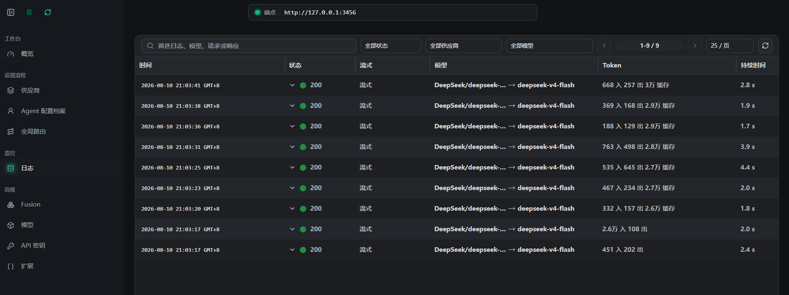

# 可观测性 / Observability

> [!NOTE]
> **教程阶段 / Guide stage:** V0.4 · 高级社区路由 / Advanced Community Routing
> **阅读范围 / Reading range:** 第 13 章 + Routing 专题 / Chapter 13 + Routing section
> **前置内容 / Prerequisite:** 先完成 V0.3；这是 Advanced / Experimental 路线，不是基础工作站必需项。 / Complete V0.3 first; this Advanced / Experimental route is optional.

## 中文

验证记录只保留时间、客户端、请求模型、最终 Provider/模型、状态、耗时、Token 数和路由决定。请求/响应正文可能含源码、提示或隐私，默认不截图、不提交。日志先用于回答“请求在哪一层失败”，不用于模型跑分。

下图来自隔离 Agent Lab 的真实 CCR Runtime：9 次请求均为 HTTP 200，并显示最终模型、Token 与耗时。它只能证明本次环境的连接与路由成功，不能作为通用性能或成本结论。

## English

Evidence may retain time, client, requested/resolved model and provider, status, latency, token count, and routing decision. Request and response bodies can contain source, prompts, or private data and should not be captured or committed. Logs diagnose layers; they are not benchmarks.

The screenshot above records a real isolated Agent Lab run: all nine requests returned HTTP 200 and expose only the resolved model, token counts, and latency. It proves routing and connectivity for this test environment, not general performance or cost.

Credential cleanup was separately verified with `/status` and the exact-response probe `CCR_AUTH_OK`. Public evidence keeps the `apiKeyHelper` source name and loopback Base URL while redacting the session ID and local path with opaque blocks.

---

### 教程导航 / Guide navigation

[← 上一篇：路由规则 / Previous: Routing rules](routing-rules.md) | [教程首页 / Guide home](../../README.md) | [下一篇：备份与安全 / Next: Backup and security →](backup-security.md)
